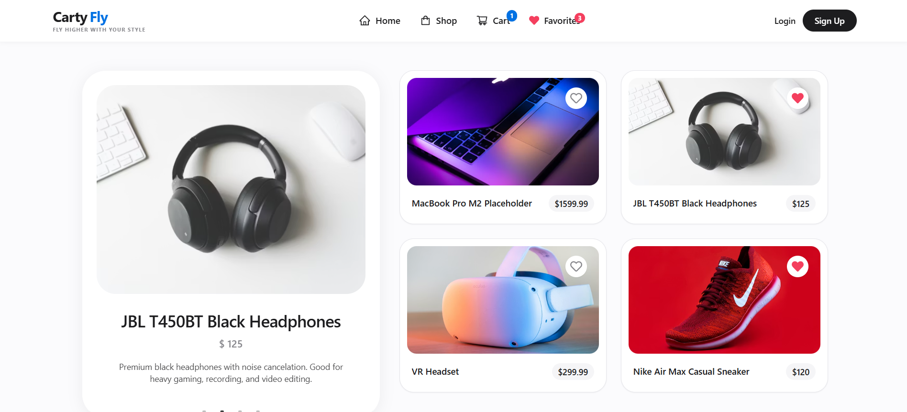
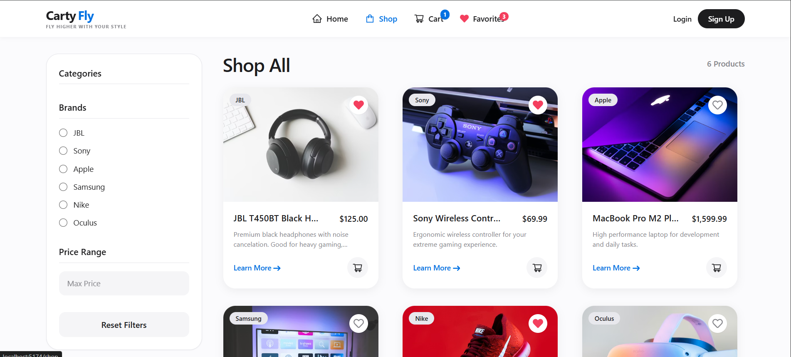
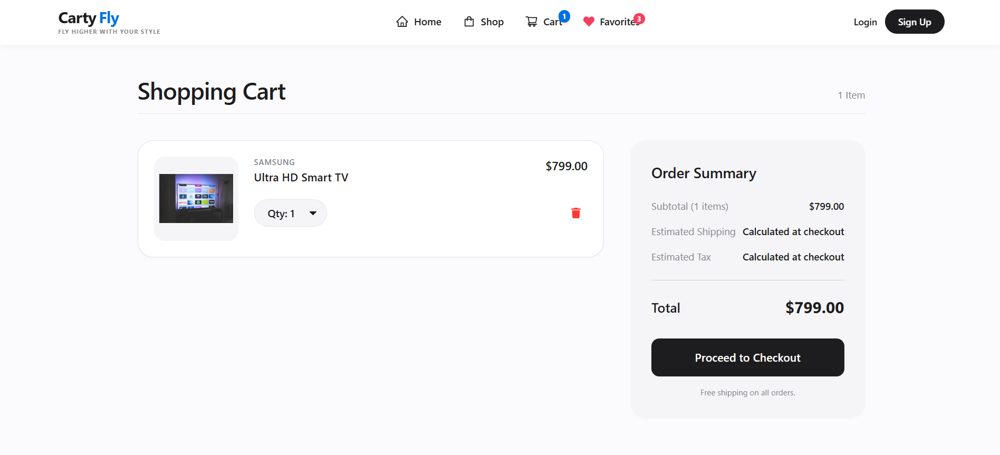

# Carty Fly 🛍️

**Carty Fly** is a modern, responsive, Apple-inspired E-Commerce web application built on the MERN stack. It features a sleek white aesthetic, lightning-fast UI, and secure authentication. 

**"Fly higher with your style"**

## 🚀 Features
- **Minimalist Apple-like Design**: Clean white background, seamless drop-shadows, and `system-ui` sans-serif fonts.
- **Top Navigation Bar**: Dual-color text logo with real-time responsive hamburger menu.
- **JSON Product Backend**: Products are fetched rapidly from a local `products.json` file.
- **Full Shopping Cart functionality**.
- **User Authentication** (JWT & Cookies).
- **Admin Dashboard** for managing users, products, categories, and orders.

## 📸 Screenshots
*(Save your screenshots in the `screenshots` folder and name them exactly as shown below to automatically appear here!)*

- **Home Page**
  <br>
  

- **Shop Page**
  <br>
  

- **Cart Interface**
  <br>
  

---

## 💻 How to Run the Application

This project runs both the frontend and backend concurrently.

1. **Install Dependencies** (if you haven't already):
   Open a terminal in the root directory and run:
   ```bash
   npm install
   cd frontend
   npm install
   cd ..
   ```

2. **Start the Development Server**:
   From the root directory, simply run:
   ```bash
   npm run dev
   ```
   *This starts the backend on port 5000 and the frontend on port 5175 (or 5173).*

3. **Visit the app**: Open your browser and go to `http://localhost:5175` (or whichever port Vite provides in the console).

---

## 👑 How to Access the Admin Dashboard

By default, newly registered users do not have admin privileges. Follow these steps to grant an account Admin access:

1. **Register an Account:**
   Go to the application (`http://localhost:5175`), click "Sign Up" in the navigation bar, and register a new user:
   - **Name:** admin
   - **Email:** admin@cartyfly.com
   - **Password:** carty123 (or any password of your choosing)

2. **Update Database Privileges:**
   Since user data is handled by MongoDB, you'll need to update your user record:
   - Open **MongoDB Compass**.
   - Connect to your local database URI: `mongodb://127.0.0.1:27017/`
   - Open the **`store`** database, and then click on the **`users`** collection.
   - Find the user you just registered.
   - Click the edit button (pencil icon) on that document.
   - Change the `isAdmin` boolean field from `false` to `true`.
   - Click **Update**.

3. **Log In to Admin:**
   - Go back to Carty Fly.
   - If you were already logged in, log out and log back in.
   - Click on your username in the top navigation bar.
   - You will now see the Admin-specific links dropdown: **Dashboard, Products, Category, Orders, and Users**.

---

## 🎨 Design & Responsiveness
- **Layout**: Features a fixed top navigation bar logic that works across devices.
- **Responsiveness**: Elements automatically stack on Mobile screens (hamburger menu activated) and elegantly scale up to grids on Tablet (`md`) and Desktop (`xl`) screens without lag.
- **Color Palette**: 
  - Text & Accents: Deep Gray `#1d1d1f` 
  - Primary Brand Color: Apple Blue `#0071e3`
  - Base Backgrounds: Pure White `/` off-white `#fbfbfd`
